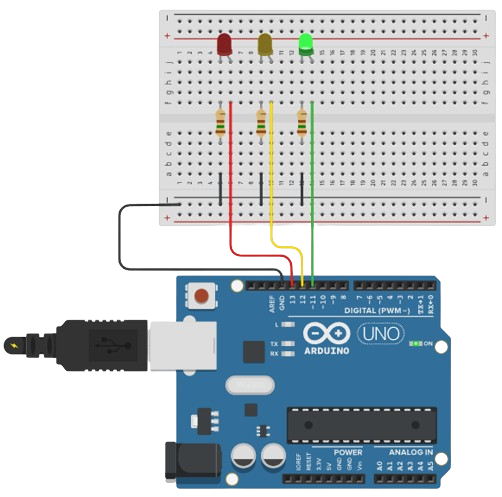

<div align="center" style="display: inline_block;">
  <a href="https://learn.microsoft.com/pt-br/cpp/cpp/?view=msvc-170" title="C++ | DOC" target="_blank" rel='noopener noreferrer'>
    
  </a>
    &nbsp;&nbsp;&nbsp;&nbsp;&nbsp;
  <a href="https://docs.arduino.cc/" title="Arduino | DOC" target="_blank" rel='noopener noreferrer'>
    
  </a>
</div><br>

<div align="center";>
  <h1>CONTROLADOR DE SEMÁFORO 🚦</h1>
</div>
  
Este repositório contém um programa simples em **C++** para Arduino que simula um controlador de semáforo utilizando três LEDs.

## 🧰 Componentes Utilizados

- Placa Arduino (Arduino Uno);
- Três LEDs (Verde, Amarelo e Vermelho);
- Resistores (Valores adequados para os LEDs);
- Jumpers (Fios para conexão).

## ⚙️ Configuração

Certifique-se de que os LEDs estão conectados aos seguintes pinos digitais na sua placa Arduino:

- **LED Verde:** Pino 11;
- **LED Amarelo:** Pino 12;
- **LED Vermelho:** Pino 13.

##  Funcionamento do Código Arduino

A função **setup()** inicializa os pinos dos LEDs como saídas:

```cpp
void setup()
{
  pinMode(11, OUTPUT);
  pinMode(12, OUTPUT);
  pinMode(13, OUTPUT);
}
```

A função **loop()** define o comportamento do semáforo:

- **Luz 🟢:** Permanece acesa por 5 segundos e depois apaga por 1 segundo.
- **Luz 🟡:** Permanece acesa por 2 segundos e depois apaga por 1 segundo.
- **Luz 🔴:** Permanece acesa por 5 segundos e depois apaga por 1 segundo.

```cpp
void loop()
{
  digitalWrite(11, HIGH);
  delay(5000);
  digitalWrite(11, LOW);
  delay(1000);
  
  digitalWrite(12, HIGH);
  delay(2000);
  digitalWrite(12, LOW);
  delay(1000);
  
  digitalWrite(13, HIGH);
  delay(5000);
  digitalWrite(13, LOW);
  delay(1000);
}
```

## 🛠️ Como Utilizar

- Conecte o Arduino ao computador através do cabo USB.
- Carregue o código para o Arduino utilizando a IDE do Arduino ou outro software compatível.
- A sequência de operação do semáforo (🟢 **->** 🟡 **->** 🔴) iniciará imediatamente após o término do carregamento.

## Imagem do Projeto em Funcionamento

<div align="center">
  <table>
    <tr>
      <td align="center">
        
      </td>
    </tr>
    <tr>
      <td align="center">
        <b>Figura 1:</b> Projeto do semáforo utilizando LEDs conectados a uma placa Arduino em funcionamento.
      </td>
    </tr>
  </table>
</div>
